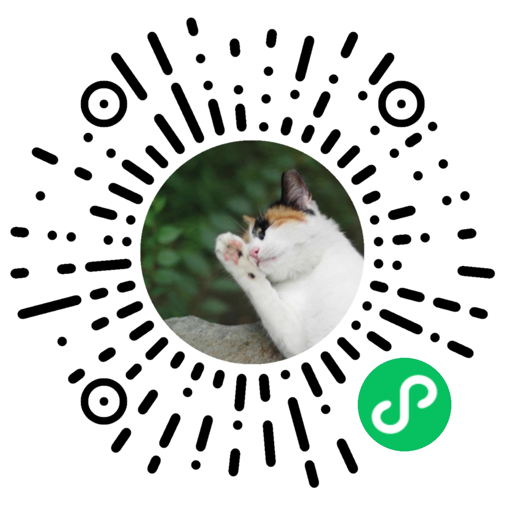

# AssembleMiniprogram

此小程序搜集各高校小动物保护组织的信息。欢迎大家加入此小程序，向 circle 提供信息。yuanlq@pku.edu.cn ，加入后可随时退出。

这个小程序将呈现组织的文字介绍、会徽图片、地理位置、小程序链接（如果有的话）。

同时欢迎大家引用此小程序

- appid：wx0fb7b06a5065be09
- 图片

### 特别注意

- **请不要将宠物抛弃在校园内！！！**

- 此小程序只是一个索引。

- 组织按照拼音首字母进行排序。

此小程序只介绍组织信息，不介绍具体猫咪信息。考虑到猫咪的安全问题，circle 不建议各位的小程序里填写猫咪的出没地点信息。

# License
MIT (不包括各个组织的 logo)